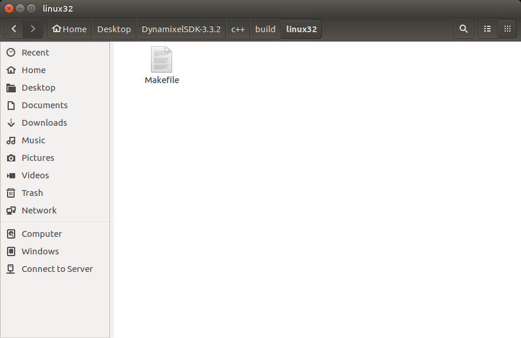
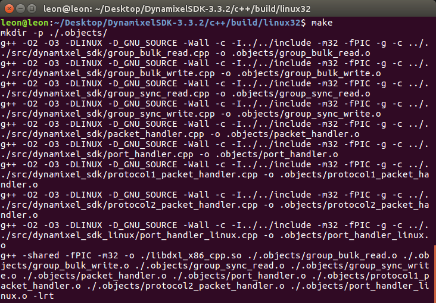
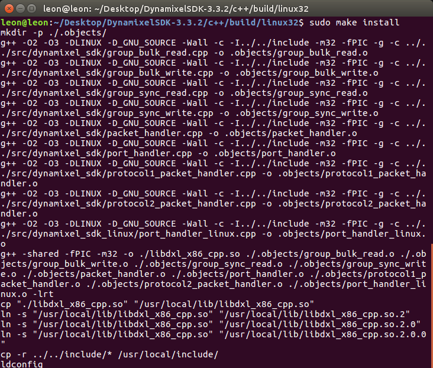
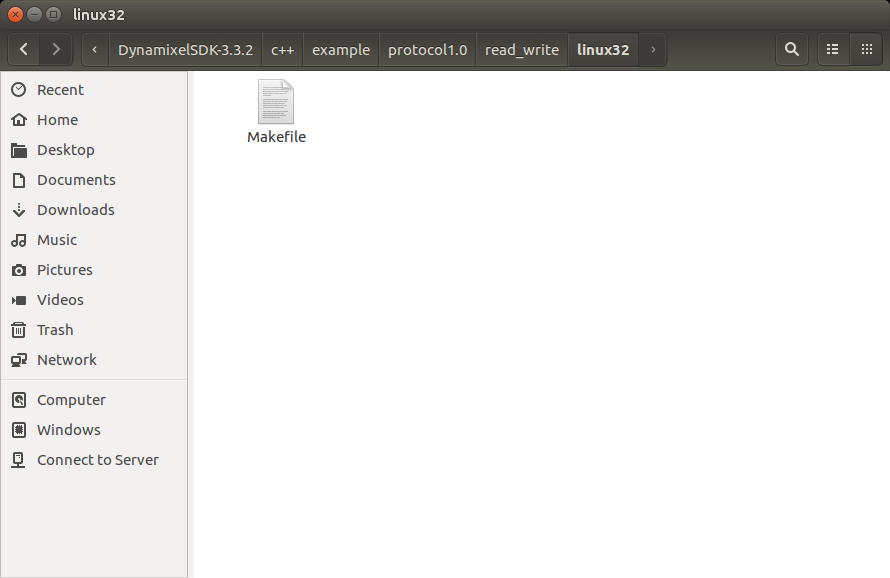
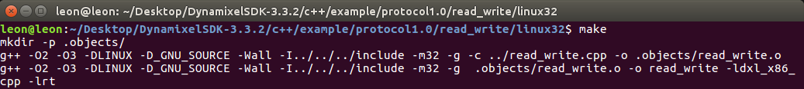
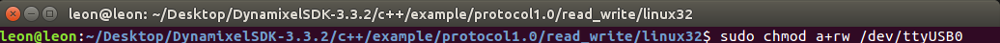
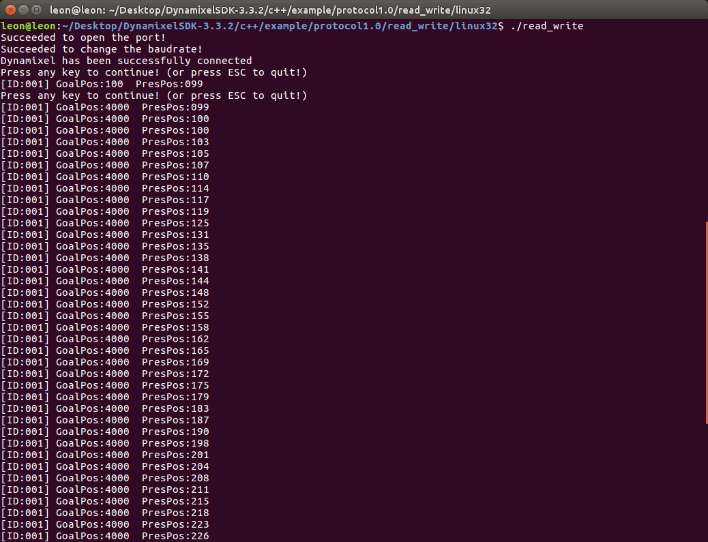

# **Instalasi Software Robot Hexapod**

## **Penginstalan Software Motion**

### **Penginstalan Dynamixel SDK**
Dynamixel SDK adalah software pengembangan yang menyediakan fungsi kendali menggunakan packet communication. API dari Dynamixel DK itu sendiri di desain untuk aktuator Dynamixel dan semua platform berbasis Dynamixel. Untuk penggunaan software ini diperlukan pemahaman dasar tentang bahasa pemrograman C/C++.

Untuk memulai langkah penginstalan dapat dilakukan dengan cara memasukkan perintah berikut kedalam terminal program:
``` css title="Perintah Penginstalan Dynamixel SDK"
$ git clone https://github.com/ROBOTIS-GIT/DynamixelSDK.git
```
Atau dapat dilakukan juga dengan langsung menekan tombol link yang tertera pada bagian Download-Repository di website [Dynamixel SDK](https://emanual.robotis.com/docs/en/software/dynamixel/dynamixel_sdk/download/#repository) dan Setelah itu kita akan memasuki tahap Library Setup.
<br>


#### **CPP Linux Library Setup (Compiler and Builder)**
##### 1.Compiler
- GNU gcc versi **5.4.0 20160609** atau lebih tinggi
- Untuk memeriksa versi compiler gcc, dapat dilakukan menggunakan perintah ini:
``` css
$ gcc -v 
```
- Download compiler yang dibutuhkan dengan perintah ini:
``` css
$ sudo apt-get install gcc-5
```
<br>

##### 2.Builder
- Dapatkan pkg yang diperlukan untuk Build menggunakan → make. Perintah yang dijalankan adalah:
``` css
$ sudo apt-get install build-essential
```
<br>

##### 3.Membuat Library
- Memilih format (64bit atau 32bit) yang ingin digunakan untuk membuat library. Library ini sendiri dapat dibuat menggunakan platform x32bit, x64bit atau SBC. Disini kami menggunakan SBC sehingga Lokasi direktori Makefile dapat ditemukan melalui address berikut: 
<br> 
`[DynamixelSDK folder]/cpp/build/linux_sbc`
<br>
Sumber contoh yang akan dibuat adalah dalam bentuk 32bit, oleh karena itu library 32bit sebaiknya dibangun.
<figure markdown="span">
    { width="600" }
</figure>

<br>

- lalu pergi ke direktori Makefile SBC yang seharusnya terletak di: <br> `[DynamixelSDK folder]/cpp/build/linux_sbc` <br> menggunakan perintah:
``` css
$ make
```
<figure markdown="span">
    { width="600" }
</figure>

<br>

- Untuk memasukkan Library ke Root Directory (Untuk menghandle serial port) menggunakan perintah:
``` css
$ sudo make install
```
<figure markdown="span">
    { width="600" }
</figure>

<br>


#### **Penjalanan sample code**
Sample code Dynamixel SDK untuk pengguna CPP menggunakan library files (atau **.so** untuk Linux), Oleh karena ini sebaiknya library file dibuat didalam path seperti ini:
<br>
`[DynamixelSDK folder]/c++/build/[linuxXX]/libdxl_xYY_cpp.so`
<br>
dengan source code nya sendiri seperti yang dapat dilihat diatas.

- Memilih format (32bit atau 64bit) yang ingin digunakan untuk pembuatan library. File MakeFile untuk Building Source berada didalam direktori seperti dibawah ini:
<br>`[DynamixelSDK folder]/c++/example/protocol1.0/read_write/linux32`<br>
atau
<br>`[DynamixelSDK folder]/c++/example/protocol1.0/read_write/linux64`<br>

!!! note
    Jika ingin membuat build example source dalam format 32bit maka library ini juga harus dibuat dalam format yang sama 
 
<figure markdown="span">
    { width="600" }
</figure>

<br>

- Lalu pada terminal, pergi ke folder MakeFile:
<br>`/c++/example/protocol1.0/read_write/linux32`<br>
sebagai contoh, membuat file executable menggunakan command ini:
``` css
$ make
```

<figure markdown="span">
    { width="600" }
</figure>

<br>

- Jika terdeteksi suatu error maka dapat menggunakan command 
`make clean` dan mamsukkan lagi commmand `make` untuk mengulangi proses pembuatan dan mencoba menghilangkan error.

<br>

- Setelah itu masukkan command ini agar port dapat digunakan:
``` css
$ sudo chmod a+rw /dev/ttyUSB0
```
<figure markdown="span">
    { width="600" }
</figure>

<br>

- Setelah semuanya berfungsi dengan baik, kita akhirnya dapat menjalankan source code menggunakan command ini:
``` css
$ ./read_write
```
<figure markdown="span">
    { width="600" }
</figure>

<br>

Untuk lebih lengkapnya mengenai proses instalasi software Dynamixel SDk dapat pada web page official Dynamixel dibawah ini.
<br>

[Dynamixel Library Setup](https://emanual.robotis.com/docs/en/software/dynamixel/dynamixel_sdk/library_setup/cpp_linux/#cpp-linux){ .md-button .md-button--primary }


<br>


## **Penginstalan Software Vision**

### **Menginstall Jetson Inference**

#### **Memperbarui Ubuntu dan Git Cmake**
Hal pertama yang harus dilakukan adalah update ubuntu dengan source code berikut:   
``` css
$ sudo apt-get update
```
Setelah itu install git cmake dengan source code berikut:
``` css
$ sudo apt-get install git cmake
```


#### **Menduplicate Library Jetson**
Lalu duplikat library jetson inference dengan source code berikut: 
``` css
$ git clone https://github.com/dusty-nv/jetson-inference
```
Setelah di duplikat masuk kedalam jetson inference dengan source code berikut:
``` css
$ cd jetson-inference
$ git submodule update --init
```


#### **Menginstall libpython3**
Lalu install libpython3 dengan source code berikut: <br>
``` css
$ sudo apt-get install libpython3-dev python3-numpy
```
Setelah itu masuk kedalam jetson inference dengan source code berikut: <br>
``` css
$ cd jetson-inference
```
Buatlah sebuah folder dengan nama build dengan source code berikut: <br>
``` css
$ mkdir build
```
Setelah buat folder lalu masuk kedalam folder build dengan source code berikut: <br>
``` css
$ cd build
```
Gunakan source code berikut untuk membuat Library: <br>
``` css
$ cmake ../
```
Lalu buka build yang ada pada folder jetson inference dengan source code berikut: <br>
``` css
$ cd jetson-inference/build
```
Setelah itu compiling library dengan source code berikut: <br>
``` css
$ make
```
Lalu install library dengan source code berikut: <br>
``` css
$ sudo make install
```
Lalu langkah terakhir penginstalan library adalah mengetik source berikut untuk menyelesaikan instalasi <br>
``` css
$ sudo ldconfig
```