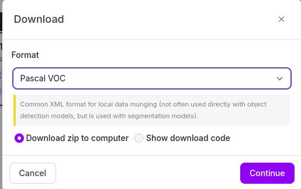

# **Instalasi Vision Robot Hexapod**

Agar robot Hexapod dapat mengenali berbagai macam objek yang ada maka robot harus mampu mengidentifikasi objek dengan mengandalkan kemampuan visualnya dan oleh karena itu kami menggunakan Roboflow agar robot hexapod dapat mendeteksi objek-objek yang nantinya akan muncul pada arena perlombaan.

Kita dapat menggunakan google colab untuk melakukan training. Sebelum melakukan training kita harus melabel terlebih dahulu. Membuat label dapat menggunakan labelimg dan roboflow. Disini kami menggunakan roboflow untuk membuat label pada gambar kami. Berikut adalah langkah – langkah membuat label diroboflow yaitu sebagai berikut :

## **Roboflow**

Bukalah website [Roboflow](https://roboflow.com/) dan masukan akun jika belum terdaftar.
Setelah memasukkan akun, klik “New Project” pada pojok kanan layar.


<br> Buatlah nama Project sesuai dengan keinginan, untuk annotating grup buatlah sesuai dengan label yang diinginkan contohnya korban/dummy. Sedangkan untuk bagian license tetap sama dan tidak ada perubahan.


<br> Pilih "Object Detection" sebagai tipe project yang akan dikerjakan.


<br> Setelah itu, klik create public project. Akan muncul tampilan seperti berikut


<br> Upload data dapat berupa video, foto ataupun pdf. Lalu annotate untuk melabel data setelah data siap di load. Berikut tampilan annotate, kita dapat menggunakan bounding box tool atau pun polygon tool untuk melabel gambar.


<br> Setelah semua selesai dilabel, klik keluar lalu klik add dataset.
Setelah itu klik version dan download dataset Akan keluar lalu pilih format, jika menggunakan ssd mobilenet maka format yang harus dipilih adalah pascal VOC.



 
Cara penggunaan roboflow telah selesai akan dilanjutkan pada proses untuk melakukan training dengan langkah – langkah sebagai berikut

- extrac file dataset yang telah kita download dari roboflow
- pastikan dataset tersebut ada didalam jendela linux kita
- buat lah dua folder didalam home dengan nama pic dan anno
- file yang sudah kita extrac tadi pisahkan antara label dan foto.
- pindahkan foto kedalam folder pic dan label ke dalam folder anno yang telah kita buat.
- buka terminal lalu masukkan commad “touch collab.py”
- lalu klik diterminal “code .”
- masukan program berikut

```css
import os
import shutil
import random

def create_directory_structure(model_name):
"""Membuat struktur direktori yang sesuai."""
os.makedirs(f"data/{model_name}/JPEGImages", exist_ok=True)
os.makedirs(f"data/{model_name}/Annotations", exist_ok=True)
os.makedirs(f"data/{model_name}/ImageSets/Main", exist_ok=True)

 def move_files(src_img_dir, src_ann_dir, dst_img_dir, dst_ann_dir):
"""Memindahkan gambar dan anotasi ke direktori tujuan."""
img_files = os.listdir(src_img_dir)
for img_file in img_files:
    shutil.copy(os.path.join(src_img_dir, img_file), os.path.join(dst_img_dir, img_file))

ann_files = os.listdir(src_ann_dir)
for ann_file in ann_files:
    shutil.copy(os.path.join(src_ann_dir, ann_file), os.path.join(dst_ann_dir, ann_file))

def write_split_file(file_list, output_file):
"""Menulis file split (train.txt, test.txt, val.txt)."""
with open(output_file, 'w') as f:
    for file in file_list:
        file_name = os.path.splitext(file)[0]  # Remove extension
        f.write(f"{file_name}\n")

def split_dataset(img_files, train_ratio=0.8, val_ratio=0.1):
"""Membagi dataset menjadi train, val, dan test."""
random.shuffle(img_files)  # Acak gambar

total_files = len(img_files)
train_end = int(total_files * train_ratio)
val_end = train_end + int(total_files * val_ratio)

train_files = img_files[:train_end]
val_files = img_files[train_end:val_end]
test_files = img_files[val_end:]

return train_files, val_files, test_files

def main():
# Nama model
model_name = input("Please enter model name: ")

# Buat struktur direktori yang sesuai
create_directory_structure(model_name)

# Direktori sumber gambar dan anotasi
# Ubah direktori sesuai dengan lokasi folder Anda di Linux
src_img_dir = "/home/username/Downloads/krsri_new.v1i.voc/pic"  # Sesuaikan dengan path di Linux
src_ann_dir = "/home/username/Downloads/krsri_new.v1i.voc/annot"  # Sesuaikan dengan path di Linux

# Direktori tujuan
jpeg_images_dir = f"data/{model_name}/JPEGImages"
annotations_dir = f"data/{model_name}/Annotations"

# Pindahkan gambar dan anotasi ke struktur direktori yang sesuai
move_files(src_img_dir, src_ann_dir, jpeg_images_dir, annotations_dir)

# Dapatkan semua file gambar
img_files = os.listdir(src_img_dir)

# Pisahkan dataset menjadi train, val, dan test
train_files, val_files, test_files = split_dataset(img_files)

# Tulis file split (train.txt, val.txt, test.txt, trainval.txt)
write_split_file(train_files, f"data/{model_name}/ImageSets/Main/train.txt")
write_split_file(val_files, f"data/{model_name}/ImageSets/Main/val.txt")
write_split_file(test_files, f"data/{model_name}/ImageSets/Main/test.txt")
write_split_file(train_files + val_files, f"data/{model_name}/ImageSets/Main/trainval.txt")

print(f"Dataset {model_name} has been organized successfully.")

if __name__ == "__main__":
main()
```


- Jalankan program tersebut dengan masuk ke terminal ketik commad      
```css 
“python3 collab.py”
```

- Sebelum dijalankan pastikan sudah ada folder dengan nama data di home.
- Setelah selesai didalam folder data akan terdapat model dan didalam model akan terdapat annotations, imageset dan JPGEImages serta buatlah file label.txt didalam model.


<br> Setelah proses diatas selesai kita bisa langsung melakukan training di google colab dengan cara sebagai berikut:

- Masuk ke google collab dan masukkan akun
- Instal jetson train dengan commad 
```css 
“! git clone https://github.com/mailrocketsystems/jetson-train.git” didalam google collab
```

- Setelah itu masukkan file data yang sudah kita dapatkan tadi ke dalam jetson train/data sesuai dengan urutan folder data.


- Setelah folder diupload jalankan program dengan mengetik code 
```css 
!python3 train_ssd.py --dataset-type=voc –data=data/{Nama model}/ --model-dir=models/{Nama model} --batch-size=40 --workers=2 --epochs=100
```

- Setelah dijalankan, tunggu sampai proses selesai.
- Setelah selesai kita harus mendapatkan hasil terbaik dari training dengan cara mengetik
```css 
!python3 result.py
```

- Setelah itu download file tersebut beserta label.txtnya.