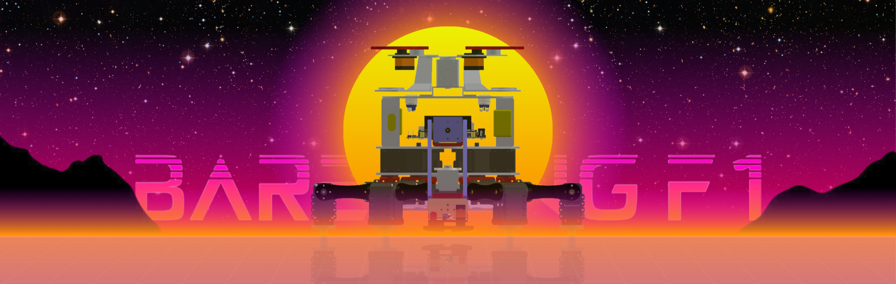
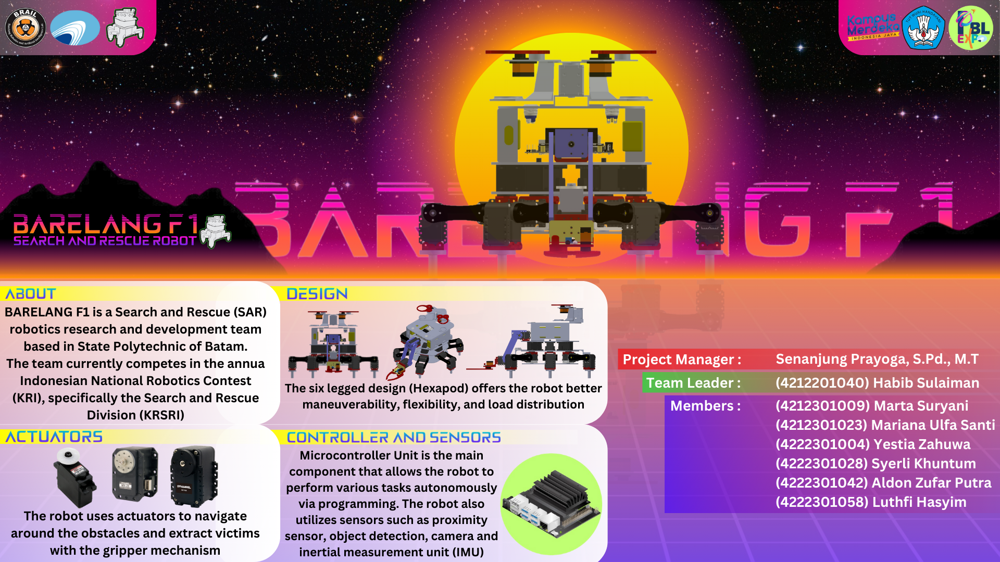

    <h1>Welcome to Barelang F1 Documentation Github</h1>
    

This is our official GitHub page for our documentation Website. 
Barelang F1 is a team comprised of several members that are focused on creating a robot that is tasked with outcoming various kinds of obstacles and challenges in a national contest that is annually held in Indonesia

---

### What Are We Working On?

We are now currently in the process of creating a hexapod robot that is tasked with overcoming various obstacles in the Robot Competition that will later be held at **July 2025**.
 
Interested in knowing more about our robot, then you might wanna check this poster out~! 
 

 

### Wanna Learn More?!

If you are curious on how we create our hexapod robot or maybe you want to make your own hexapod robot by any chance, then feel free take to a peek at our documentation website where we neatly documented every single bit of our progress!

  
  [**VISIT OUR WEB**](https://barelangf1.my.id) 
  

#### Don't forget to also follow our social media to find more awesome stuffs

